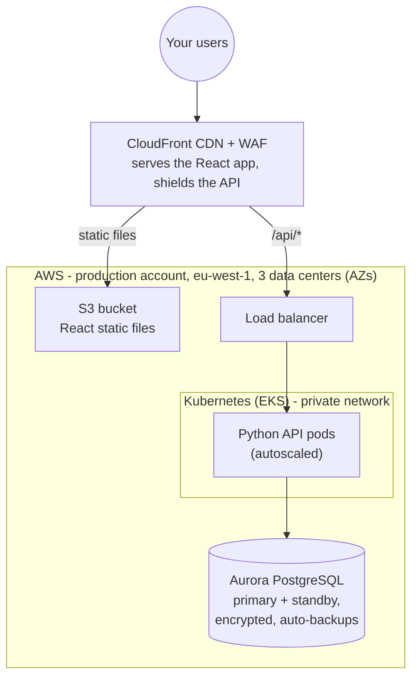
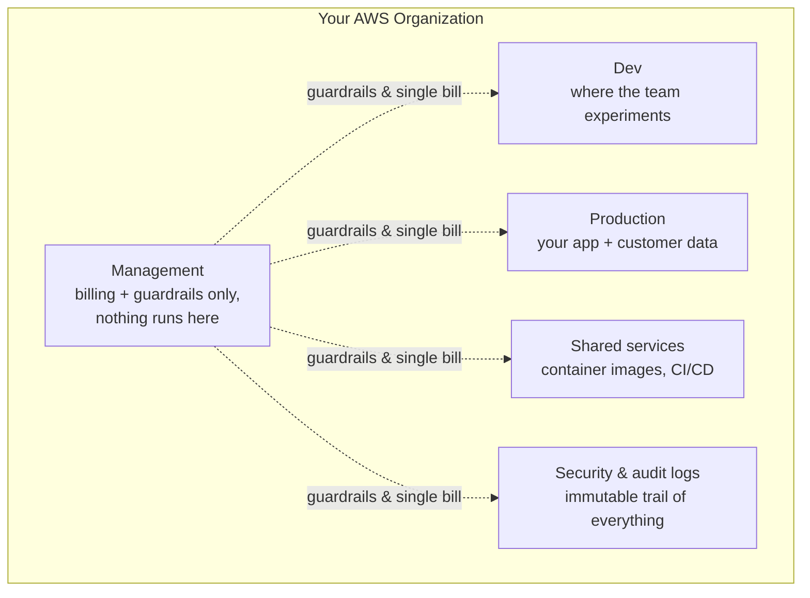
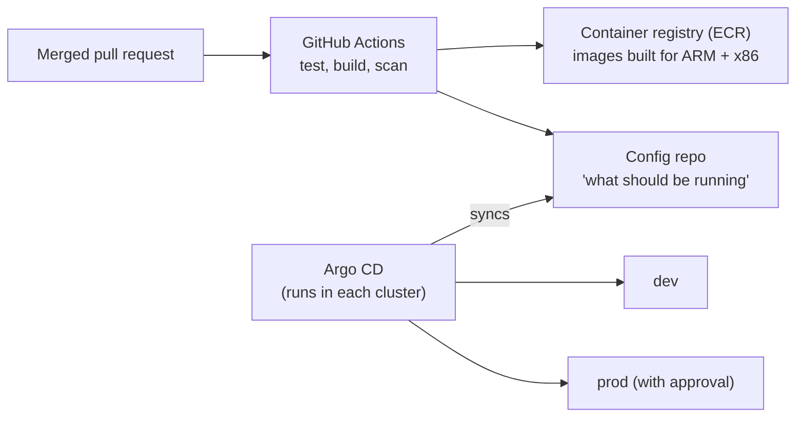

# Innovate Inc. - Cloud Architecture Proposal

**Prepared for:** Innovate Inc. • **Date:** June 2026 • **Status:** Proposal

## What you're getting, in plain terms

You're building a web app - a React frontend, a Python API, and a PostgreSQL
database - that holds sensitive user data. Today you have a few hundred users a
day. You want to be ready for millions, without rebuilding everything when
growth arrives, and without burning your runway on infrastructure in the
meantime.

This proposal gives you exactly that, on **AWS**:

- **Start small and cheap:** roughly **$300–450/month** for a production
environment plus a dev environment (estimates below).
- **Scale by turning dials, not by re-architecting:** every component below
scales from "hundreds of users" to "millions" by changing settings, not
designs.
- **Security from day one:** your customer data sits in an isolated production
account, encrypted everywhere, behind a web firewall, with an audit trail
that nobody - including an attacker - can quietly erase.
- **No undifferentiated heavy lifting:** AWS runs the Kubernetes control
plane, the database engine, the load balancers, and the backups. Your team
ships product.

A full **GCP alternative** is described in [gcp-alternative.md](./gcp-alternative.md)

- the design translates cleanly if you have GCP credits or a strong preference.

---

## The big picture

Three deliberate choices shape everything else:

1. **The frontend never touches Kubernetes.** React builds to static files;
  S3 + CloudFront serve them globally for a few dollars a month. Running a
   web server fleet to serve static files is money down the drain.
2. **The API runs on Kubernetes (EKS), sized by actual demand.** Nodes are
  added and removed automatically, minute by minute. At low traffic you pay
   for almost nothing; during a spike, capacity appears in about a minute.
3. **The database is fully managed (Aurora PostgreSQL).** Backups, failover,
  patching, and encryption are AWS's problem, not yours. With sensitive user
   data and no DBA on staff, self-hosting PostgreSQL is a risk with no upside.

---

## 1. Account structure: how we keep things separated

AWS lets you split your infrastructure into separate **accounts** - think of
them as fireproof compartments. A mistake (or a breach) in one cannot spread
to the others. This is the single strongest security control AWS offers, and
it's free.

We recommend starting with **five accounts**, adding a sixth (staging) when
the team grows:

| Account             | What it's for                              | Why it's separate                                                           |
| ------------------- | ------------------------------------------ | --------------------------------------------------------------------------- |
| **Management**      | Billing, login (SSO), org-wide guardrails  | If a workload account is compromised, the attacker can't touch the controls |
| **Security/logs**   | Tamper-proof audit logs from every account | Auditors love it; attackers can't cover their tracks                        |
| **Shared services** | Container image registry, CI/CD            | One source of truth for what gets deployed everywhere                       |
| **Dev**             | Day-to-day development                     | Developers move fast without any chance of touching prod data               |
| **Production**      | The live app and customer data             | A hard wall around the thing that matters most                              |

Two practical notes that save pain later: log in through **SSO** (no shared
passwords, no permanent access keys), and apply guardrails like *"nobody can
create resources outside Europe"* and *"nobody can delete audit logs"* from
day one. Both cost nothing.

**Cost of all this structure: ~$0.** Accounts are free; you pay only for what
runs inside them.

---

## 2. Network: private by default

Each environment gets its own isolated network (a **VPC**) spread across
**three data centers** (Availability Zones), so the loss of one never takes
you down. Inside it, three layers:

| Layer   | What lives there            | Internet access                |
| ------- | --------------------------- | ------------------------------ |
| Public  | Load balancer only          | Yes - it's the front door      |
| Private | Kubernetes nodes (your API) | Outbound only, via NAT         |
| Data    | The database                | **None. Physically no route.** |

Security, from the outside in:

- **CloudFront + AWS WAF** at the edge: blocks common attacks (SQL injection,
bots, request floods) before they reach you, and serves your frontend fast
worldwide.
- The **load balancer accepts traffic only from CloudFront** - nobody can go
around the firewall.
- Kubernetes nodes have **no public addresses**; its management endpoint is
reachable only by your team via SSO.
- The **database accepts connections only from the Kubernetes nodes**, on one
port, inside the private network.
- **Threat detection (GuardDuty) and audit logging (CloudTrail)** run
org-wide, reporting into the security account.

**Cost-saving choice we recommend:** start with **one NAT gateway** instead of
three (~$37/month instead of ~$110). The trade-off: if its data center has an
outage, your API briefly loses *outbound* internet access (inbound traffic and
the database are unaffected). For a pre-revenue startup that's the right
trade; we flip to three (one per AZ) when uptime promises to customers demand it

- a one-line change.

---

## 3. Compute: Kubernetes that right-sizes itself

### The cluster

**Amazon EKS** (managed Kubernetes), one cluster per environment, always on a
current Kubernetes version. AWS operates the control plane for $73/month;
there is no realistic scenario where running your own control plane is worth
a startup's time.

### The nodes - where the cost magic happens

A fixed fleet of servers would be money wasted at your traffic level. Instead,
a small fixed core plus an autoscaler:

- **Two small always-on nodes** run the cluster's own machinery (DNS, the
autoscaler itself). That's the entire fixed compute cost.
- **Karpenter** (the autoscaler) launches and removes application nodes
automatically, matching what your pods actually request - typically within
60 seconds. Idle capacity is consolidated away instead of sitting on the
bill.

Two policies make these nodes dramatically cheaper:

1. **ARM-based Graviton processors by default.** Same workloads, roughly
  **20–40% better price/performance** than equivalent x86. Python and React
   build natively for ARM - for most teams this is free money. We keep **two
   node pools - ARM (`arm64`) and x86 (`amd64`)** - so anything with an
   x86-only dependency just declares one line in its manifest and lands on the
   right hardware:
2. **Spot instances first.** Spot is AWS's spare capacity at **60–90% off**.
  The catch - AWS can reclaim a machine with 2 minutes' notice - is handled
   by Kubernetes: your API is stateless, so pods just drift to another node
   while the load balancer keeps routing around them. Users notice nothing.
   Anything that can't tolerate that pins itself to regular (on-demand)
   instances with, again, one line. If Spot is briefly unavailable, the
   autoscaler falls back to on-demand automatically.

Day one, this means: **2 small fixed nodes + 1–2 Spot Graviton nodes ≈
$70–100/month** of compute serving the entire production API - with a
ceiling of millions of users reachable by raising autoscaler limits.

Standard production hygiene is configured from the start: every container
declares its CPU/memory needs, disruption budgets keep a minimum number of API
pods alive through any node churn, and pods spread across the three AZs.

### How code ships

- CI builds **one image that runs on both ARM and x86**, scans it for
vulnerabilities, and pushes it to the registry. CI logs into AWS with
short-lived tokens - **no stored cloud passwords**.
- Deployment is **GitOps**: a Git repo describes what should be running; Argo
CD keeps each cluster matching it. Promoting to prod is a pull request plus
an approval click. Rolling back is reverting a commit.
- Nobody - human or CI system - holds standing production credentials.

---

## 4. Database:

**Recommendation: Amazon Aurora PostgreSQL, Serverless v2.**

| Option                   | Monthly cost to start          | Verdict                                                                                                                                                                                  |
| ------------------------ | ------------------------------ | ---------------------------------------------------------------------------------------------------------------------------------------------------------------------------------------- |
| Run PostgreSQL ourselves | ~$30 in compute, **high risk** | No. You'd own failover, backups, patching, and corruption recovery - with customer data at stake.                                                                                        |
| Standard RDS PostgreSQL  | ~$30–60                        | A fine budget fallback. Slower failover (1–2 min), read scaling is clunkier.                                                                                                             |
| **Aurora Serverless v2** | **~$50–100**                   | Capacity scales up and down with load automatically. Failover ~30s. Reads scale to 15 replicas when you're big. The "hundreds today, millions later" profile is literally what it's for. |

The premium over basic RDS buys the *scaling path*: when growth hits, you add
read replicas and raise the capacity ceiling - no migration, no downtime, no
re-platforming. In **dev, Aurora auto-pauses to zero** when idle (evenings,
weekends), so the dev database costs almost nothing.

**Protection of your data:**

| Mechanism                                                                                         | What it covers                                            |
| ------------------------------------------------------------------------------------------------- | --------------------------------------------------------- |
| Continuous backup, point-in-time restore (35 days)                                                | "We just deleted the wrong table" - restore to any second |
| Standby in a second AZ, automatic ~30s failover                                                   | A data center failure                                     |
| Daily encrypted snapshot copied to a second region                                                | A whole-region disaster                                   |
| Encryption at rest + TLS in transit, credentials in Secrets Manager (auto-rotated), never in code | Theft and leaks                                           |

We also put **RDS Proxy** (a managed connection pooler, ~$15/month) between the
API and the database - Python web apps multiplied by autoscaling pods are
famous for exhausting PostgreSQL connections, and this removes that whole
class of incident while halving failover time.

Disaster-recovery posture, stated honestly: an AZ failure costs you ~1 minute
and zero data. A full region failure initially means restoring from snapshots
in another region - hours of downtime, up to 24h of data at absolute worst.
When the business can't accept that anymore, **Aurora Global Database**
(Phase 3) drops region-failure data loss to ~1 second. We test restores
quarterly, because an untested backup is a hope, not a plan.

---

## 5. What it costs

Approximate monthly figures, eu-west-1, June 2026 pricing. Treat as ±20%;
the deliberately-cheap launch posture is baked in (single NAT, Spot+Graviton,
serverless database, dev auto-pausing).

### Launch (now → first thousands of users)

| Item                                  | Production    | Dev                          |
| ------------------------------------- | ------------- | ---------------------------- |
| EKS control plane                     | $73           | $73                          |
| Fixed nodes (2 small Graviton)        | ~$60          | ~$30 (smaller, off at night) |
| App nodes (Graviton Spot, autoscaled) | ~$20–40       | ~$10                         |
| Load balancer                         | ~$25          | ~$20                         |
| NAT gateway (single)                  | ~$37          | ~$37                         |
| Aurora Serverless v2                  | ~$60–100      | ~$5–15 (auto-pause)          |
| RDS Proxy                             | ~$15          | -                            |
| CloudFront + S3 (frontend)            | ~$5           | ~$1                          |
| WAF                                   | ~$10–15       | -                            |
| Registry, secrets, logs, GuardDuty    | ~$20–30       | ~$10                         |
| **Total**                             | **~$330–400** | **~$190–200**                |

**≈ $520–600/month all-in** for a production-grade, audited, encrypted,
3-AZ setup. For context: that's a fraction of one engineer-day - and the
alternative (one big VM and a hand-run database) tends to cost far more than
the difference in the first incident.

If that still needs trimming: standard RDS instead of Aurora (−$40), merge
WAF rules (−$10), and dev cluster torn down outside working hours via IaC
(−$50–100). Floor is roughly **$400/month** total before the trade-offs stop
being worth it.

### Growth (~100k users) - same architecture, bigger dials

~$1,500–2,500/month: more Spot nodes (still mostly Graviton), per-AZ NAT,
Aurora scaled up with a read replica, staging environment added. **Nothing is
redesigned.**

### Scale (millions of users) - still the same architecture

~$8k–15k/month, dominated by database and compute, managed with reserved
pricing (Savings Plans: another ~30–40% off the fixed core) and a FinOps
review cadence. The companies that get into cost trouble at this stage are
the ones who *didn't* start on autoscaling + Spot + ARM - retrofitting
efficiency is much harder than growing with it.

### The three cost principles

1. **Pay for demand, not for headroom** - autoscaling everywhere: pods,
  nodes, database capacity.
2. **Cheapest hardware that does the job** - Graviton by default, Spot first,
  x86 only where a dependency demands it.
3. **Make waste visible** - billing alerts from day one, per-account bills,
  cost allocation tags, and a monthly 30-minute cost review.

---

## 6. Rollout plan

| Phase                     | When     | What                                                                                                      |
| ------------------------- | -------- | --------------------------------------------------------------------------------------------------------- |
| **0 - Foundations**       | Week 1–2 | Accounts, SSO, guardrails, audit logging. Mostly free; pays for itself forever.                           |
| **1 - Dev environment**   | Week 2–4 | Dev VPC + EKS + autoscaling, registry, CI/CD pipeline, dev database. Team deploys to Kubernetes daily.    |
| **2 - Production**        | Week 4–8 | Prod account build-out, CloudFront + WAF, Aurora with backups/DR, alerting, on-call basics. **Go live.**  |
| **3 - As growth demands** | Later    | Staging env, per-AZ NAT, read replicas, Aurora Global Database, SOC 2 evidence collection, Savings Plans. |

Everything is Terraform from day one - environments are reproducible, dev can
be torn down and rebuilt in an hour, and the infrastructure itself is
code-reviewed.

---

*GCP version of this architecture: [gcp-alternative.md](./gcp-alternative.md).*