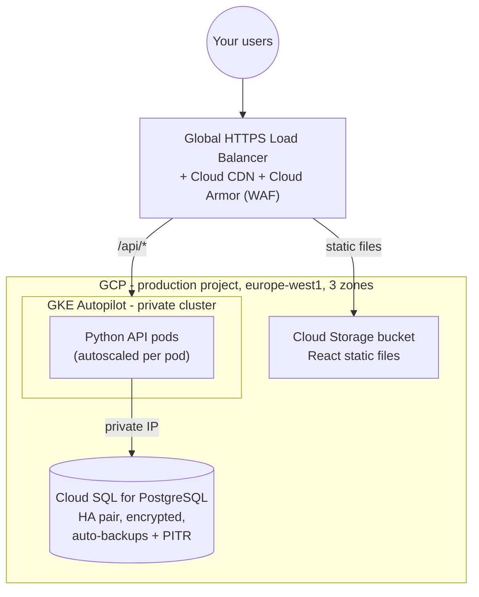

# Innovate Inc. on GCP - the alternative build

The [main proposal](./README.md) recommends AWS, but the same architecture
maps cleanly onto Google Cloud. This document describes the GCP build on its
own terms - not just a service-name translation - including where GCP is
genuinely *better* for a startup, and what it costs.

**When GCP is the right call for you:** you have **Google Cloud credits**
(startup programs commonly hand out $100k–350k - if you have these, the cost
discussion below largely evaporates for 1–2 years), your team already lives in
Google Workspace, you expect heavy analytics (BigQuery is best-in-class), or
you want the lowest-touch Kubernetes available (GKE Autopilot).

---

## The big picture



One structural difference from AWS jumps out: **a single global load
balancer** (with Cloud CDN and the Cloud Armor firewall attached) replaces
the CloudFront + WAF + ALB chain. One anycast IP, one certificate, one place
to configure routing for both the static frontend and the API. Less moving
parts is a real operational win.

---

## 1. Organization: projects instead of accounts

GCP's isolation unit is the **project** - lighter-weight than an AWS account,
so you use them more freely. Same compartmentalization logic as the AWS
proposal:

| Project | Purpose |
|---|---|
| `innovate-prod` | The live app and customer data |
| `innovate-dev` | Day-to-day development |
| `innovate-shared` | Artifact Registry (container images), CI/CD service accounts |
| `innovate-logging` | Org-wide audit log sink, locked down |
| *(later)* `innovate-staging` | Pre-production, when the team grows |

Projects sit in folders under one **Organization**; **Org Policies** provide
the guardrails ("EU regions only", "no public IPs on VMs", "no service
account keys" - that last one is a GCP-specific gem worth enabling
immediately). Login is **Cloud Identity** SSO, which is frictionless if
you're already on Google Workspace. Billing is one account with per-project
breakdown built in.

Cost of the structure itself: $0, same as AWS.

---

## 2. Network

One **VPC per environment**, each in its own project. GCP subnets are
regional (not per-zone like AWS), which simply means fewer subnets to manage:

- One subnet for GKE (with secondary ranges for pods/services - GKE sets
  this up),
- The database attaches via **private IP** (Private Service Connect) - it has
  no public address at all,
- **Cloud NAT** for outbound internet from the cluster. It's a managed
  service, not per-zone appliances - **no per-AZ-NAT cost decision to agonize
  over** (~$1/month + data processed at low traffic; one of the quiet ways
  GCP is cheaper at small scale).

Security layering mirrors the AWS design: **Cloud Armor** at the edge (OWASP
rules, rate limiting, bot management), the load balancer is the only public
entry point, the GKE control plane is **private** (team access via SSO +
IAP), firewall rules allow only cluster→database on 5432, **Security Command
Center + immutable audit logs** for detection and forensics.

---

## 3. Compute: GKE, with a real decision to make

GKE comes in two modes, and for a startup the choice matters:

| | **Autopilot (recommended at launch)** | Standard + node auto-provisioning |
|---|---|---|
| You manage | Nothing below the pod | Node pools (like AWS/Karpenter) |
| You pay for | **Exactly the CPU/RAM your pods request** | The VMs, whatever's on them |
| Cluster fee | ~$73/mo (one per billing account is free) | ~$73/mo (same waiver) |
| Best when | Small team, spiky/low traffic | Heavy, steady utilization; special node needs |

**Start on Autopilot.** With per-pod billing there are *no idle nodes at all*
- at a few hundred users/day your entire API might bill for ~1 vCPU. There's
no autoscaler to install or babysit (this is where the AWS design needs
Karpenter; on Autopilot the equivalent is simply built in). If utilization
later becomes high and steady, moving to Standard mode is a migration of
manifests, not of architecture.

The **ARM + x86 strategy carries over intact**: GCP's ARM machines (Axion
`C4A`, Tau `T2A`) offer the same 20–40% price/performance edge as Graviton,
and **Spot pricing (60–91% off)** applies in both modes. The same one-line
selectors do the work - this part of your developers' world is identical on
either cloud:

```yaml
nodeSelector:
  kubernetes.io/arch: arm64        # ARM (or amd64 for x86)
spec:
  terminationGracePeriodSeconds: 25
# Autopilot: request Spot with a selector too:
#   cloud.google.com/gke-spot: "true"
```

### Shipping code

Identical to the AWS proposal, by design: GitHub Actions builds **one
multi-arch image** (ARM + x86), scans it, pushes to **Artifact Registry**
(scan-on-push enabled); **Argo CD** syncs each cluster from a Git config repo;
prod deploys need a PR approval; rollback is a revert. CI authenticates via
**Workload Identity Federation** - GCP's version of "no stored cloud
passwords", and since org policy already bans service-account keys, this
isn't just best practice, it's enforced.

---

## 4. Database: Cloud SQL first, AlloyDB when you've earned it

| Option | Monthly to start | Verdict |
|---|---|---|
| Self-managed PostgreSQL | ~$25 + your nights | No. Same reasoning as AWS - sensitive data, no DBA. |
| **Cloud SQL for PostgreSQL (recommended)** | **~$50–90 (HA)** | Managed PostgreSQL with HA pair, automatic failover, PITR backups. The pragmatic choice. |
| AlloyDB | ~$200+ | GCP's Aurora-class engine: faster, columnar cache, better read scaling. Worth it at growth stage, not at launch. |

Start with **Cloud SQL Enterprise edition, 2 vCPU ARM-class instance with
HA** in prod; dev runs a tiny non-HA instance turned off out of hours.
Connection pooling via **PgBouncer or Cloud SQL's built-in managed pooler**
(same connection-storm protection RDS Proxy provides on AWS).

Data protection: automated backups + **point-in-time recovery**, **cross-region
backup copies** for disaster recovery, HA failover ~60s, encryption at rest
by default + TLS enforced, credentials in **Secret Manager** with rotation,
delivered to pods via Workload Identity. The honest DR posture matches the
AWS doc: zone failure ≈ 1 minute, region failure initially = restore from
copies (hours); when that's no longer acceptable, add a cross-region read
replica (Cloud SQL) or step up to AlloyDB with cross-region replicas.
Restores tested quarterly.

---

## 5. What it costs on GCP

Same assumptions as the AWS estimate (europe-west1, June 2026, ±20%,
cheap-launch posture). The structural differences: Autopilot eliminates idle
node cost entirely, Cloud NAT is ~free at low traffic, one GKE cluster fee is
waived per billing account.

### Launch

| Item | Production | Dev |
|---|---|---|
| GKE cluster fee | $73 | $0 (free-tier waiver on one cluster) |
| API compute (Autopilot, Spot+ARM pods) | ~$30–60 | ~$10–20 |
| Global LB + Cloud CDN | ~$25 | ~$20 |
| Cloud NAT | ~$2–5 | ~$2 |
| Cloud Armor (WAF) | ~$10–15 | - |
| Cloud SQL (HA) | ~$50–90 | ~$5–10 (off at night) |
| Storage/registry/secrets/logging | ~$15–25 | ~$10 |
| **Total** | **~$210–290** | **~$50–80** |

**≈ $260–370/month all-in** - typically **30–40% cheaper than the AWS
launch posture**, almost entirely because Autopilot bills per pod (no fixed
node floor, no NAT gateways, one cluster fee waived). This is GCP's honest
advantage at the "few hundred users" stage. And again: with startup credits,
this number is $0 for a long time.

### Growth and scale

The gap narrows as utilization rises (steady high load is where paying for
whole VMs beats paying per pod - that's the Autopilot→Standard switch), and
at scale both clouds land in the same $8k–15k/month band driven by database
and compute, managed with committed-use discounts (GCP's equivalent of
Savings Plans, up to ~46% off).

---

## Bottom line: how to choose

| Factor | Edge |
|---|---|
| Lowest cost at launch, least ops effort | **GCP** (Autopilot per-pod billing, managed NAT, simpler edge) |
| Startup credits in hand | **Whoever gave them to you** - this dominates everything else at your stage |
| Ecosystem breadth, hiring pool, third-party tooling | **AWS** |
| Analytics-heavy future | **GCP** (BigQuery) |
| ARM + Spot + Kubernetes + GitOps strategy | **Tie** - works identically on both |

Both builds deliver the same promise: start at a few hundred dollars a month,
scale to millions of users by turning dials. The developer experience -
Kubernetes manifests, one-line architecture selection, Git-driven deploys -
is deliberately identical, which also means **choosing one today does not
trap you tomorrow**.
